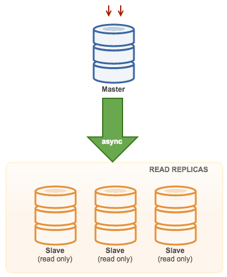

# MySQL-v8 Master-Slave Replication:

MySQL version 8 supports master-slave replication, which allows you to replicate data from one MySQL server (the master) to another MySQL server (the slave). This can be useful for various purposes such as load balancing, data backup, and high availability.

This the most straight-forward MySQL replication topology. One master receives writes, one or more slaves replicate from the same master via asynchronous or semi-synchronous replication. 





Here are the general steps to set up master-slave replication:

## Prerequisites: 
- Two/Three separate physical or virtual servers (One Master Node and One Slave or Two Salve Node)
- MySQL 8.x is installed and running on both servers.
- Assign unique server IDs to each MySQL instance.
- Enable binary logging on both servers.
- Create a dedicated MySQL user for replication with the necessary privileges.


## Step-1: MySQL Configuration File for "Master":

Open your MySQL configuration file (typically my.cnf or my.ini) on the master server. Here is custom location for own purpose.

Add or modify the following lines:


```
[client]
socket = /mysqldb/8.0.34/dbs/data/mysql.sock

[mysqld]

server-id = 1
bind-address = 0.0.0.0
port = 3306

basedir = /mysqldb/8.0.34/mysql-8.0.34
datadir = /mysqldb/8.0.34/dbs/data

log-bin = /mysqldb/8.0.34/dbs/data/master-bin.log
#binlog-do-db = your_database_name

socket = /mysqldb/8.0.34/dbs/data/mysql.sock

log-error = /mysqldb/8.0.34/logs/error.log

```


Save the changes and restart the MySQL service:

```
systemctl restart mysql
```


```
netstat -tlpn | grep 3306

tcp        0      0 0.0.0.0:3306     0.0.0.0:*     LISTEN      8491/mysqld
```


## Step-2: MySQL Configuration File for Slave-1 and Slave-2:

__On Slave-1:__

Add or modify the following lines to the configuration file:


```
[client]
socket = /mysqldb/8.0.34/dbs/data/mysql.sock

[mysqld]

server-id = 2
bind-address = 0.0.0.0
port = 3306

basedir = /mysqldb/8.0.34/mysql-8.0.34
datadir = /mysqldb/8.0.34/dbs/data

log-bin = /mysqldb/8.0.34/dbs/data/slave1-bin.log
#binlog-do-db = your_database_name

socket = /mysqldb/8.0.34/dbs/data/mysql.sock

log-error = /mysqldb/8.0.34/logs/error.log

```


__On Slave-2:__

Add or modify the following lines to the configuration file:

```
[client]
socket = /mysqldb/8.0.34/dbs/data/mysql.sock

[mysqld]

server-id = 3
bind-address = 0.0.0.0
port = 3306

basedir = /mysqldb/8.0.34/mysql-8.0.34
datadir = /mysqldb/8.0.34/dbs/data

log-bin = /mysqldb/8.0.34/dbs/data/slave2-bin.log
#binlog-do-db = your_database_name

socket = /mysqldb/8.0.34/dbs/data/mysql.sock

log-error = /mysqldb/8.0.34/logs/error.log
```


Save the changes and restart the MySQL service on both slave nodes:

```
systemctl restart mysql
```


```
netstat -tlpn | grep 3306

tcp        0      0 0.0.0.0:3306     0.0.0.0:*     LISTEN      8491/mysqld
```


## Step-3: Create Replication User:

Log in to MySQL on the master server, create a MySQL user for replication. Replace "replicator" and "your_password" with your desired username and password.

__On Master:__

```
### Log in to MySQL on the master node:

mysql -u root -p
```


```
create user 'replicator'@'%' identified with mysql_native_password by 'secret';

grant replication slave on *.* to 'replicator'@'%';

FLUSH PRIVILEGES;
```


```
SHOW GRANTS FOR 'replicator'@'%';
```


```
use mysql;
select user,host,plugin from user;
```


## Step-4: Get the Master Log File and Position:

__On Master Node, get the current master status:__

```
SHOW VARIABLES LIKE 'server_id';

+---------------+-------+
| Variable_name | Value |
+---------------+-------+
| server_id     | 1     |
+---------------+-------+
```


```
show binary logs;

+-------------------+-----------+-----------+
| Log_name          | File_size | Encrypted |
+-------------------+-----------+-----------+
| master-bin.000001 |       157 | No        |
| master-bin.000002 |       839 | No        |
+-------------------+-----------+-----------+
```


```
SHOW MASTER STATUS;

+-------------------+----------+--------------+------------------+-------------------+
| File              | Position | Binlog_Do_DB | Binlog_Ignore_DB | Executed_Gtid_Set |
+-------------------+----------+--------------+------------------+-------------------+
| master-bin.000002 |      839 |              |                  |                   |
+-------------------+----------+--------------+------------------+-------------------+

```


__On Slave-1 Node, get the current Slave status:__

```
SHOW VARIABLES LIKE 'server_id';
+---------------+-------+
| Variable_name | Value |
+---------------+-------+
| server_id     | 2     |
+---------------+-------+
```


__Repeat on Slave-2 Node, get the current Slave status:__

```
SHOW VARIABLES LIKE 'server_id';

+---------------+-------+
| Variable_name | Value |
+---------------+-------+
| server_id     | 3     |
+---------------+-------+
```


## Step 5: Set up Replication on both slaves:

Log in to MySQL on the slave node, Replace 'master_ip', 'replicator', 'password', 'master-bin.000002', and 839  with  the appropriate log file and position.


__On Slave-1:__

```
STOP REPLICA;
```


```
CHANGE REPLICATION SOURCE TO
SOURCE_HOST='master_ip',
SOURCE_USER='replicator',
SOURCE_PASSWORD='secret',
SOURCE_LOG_FILE='master-bin.000002',
SOURCE_LOG_POS=839;
```


```
### Start Replication: 

START REPLICA;
```


__On Slave-2:__

```
STOP REPLICA;
```


```
CHANGE REPLICATION SOURCE TO
SOURCE_HOST='master_ip',
SOURCE_USER='replicator',
SOURCE_PASSWORD='secret',
SOURCE_LOG_FILE='master-bin.000002',
SOURCE_LOG_POS=839;

```


```
### Start Replication: 

START REPLICA;
```


## Step-6: Verify Replication:
Look for the "Slave_IO_Running" and "Slave_SQL_Running" fields. Both should be "Yes" if replication is working correctly.

Check the replication status on slave nodes:

__On Slave-1:__

```
SHOW SLAVE STATUS\G;
```

__On Slave-2:__

```
SHOW SLAVE STATUS\G;
```


**On Master**
```
SHOW REPLICAS;

+-----------+------+------+-----------+------------------------------+
| Server_Id | Host | Port | Source_Id | Replica_UUID                 |
+-----------+------+------+-----------+------------------------------+
|         3 |      | 3306 |         1 | ab7ae470-bfd0-11ee-8fe7-xxxx |
|         2 |      | 3306 |         1 | c8f4c886-bfcc-11ee-9fa4-xxxx |
+-----------+------+------+-----------+------------------------------+
```


__On Master:__

```
create database db1;
```


```
show databases;

+--------------------+
| Database           |
+--------------------+
| db1                |
| information_schema |
| mysql              |
| performance_schema |
| sys                |
+--------------------+
```


__On Slave-1:__

```
show databases;

+--------------------+
| Database           |
+--------------------+
| db1                |
| information_schema |
| mysql              |
| performance_schema |
| sys                |
+--------------------+
```


__On Slave-2:__

```
show databases;

+--------------------+
| Database           |
+--------------------+
| db1                |
| information_schema |
| mysql              |
| performance_schema |
| sys                |
+--------------------+
```


**Set the database read only:**

__On Slave-1 and On Slave-2:__

```
alter database db1 read only = 1;
```


That's it! Your MySQL master-slave replication should now be set up and running. Keep in mind that this is a basic setup, and there are additional configurations and considerations depending on your specific requirements and environment. Always refer to the official MySQL documentation for more detailed and up-to-date information.


